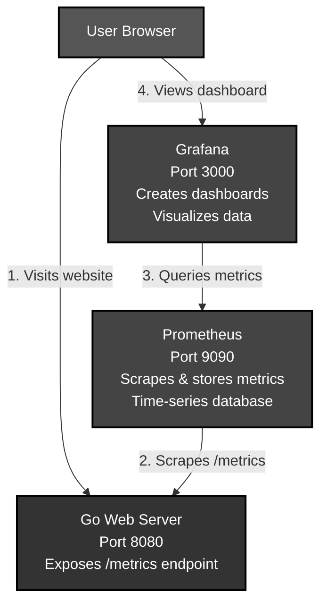
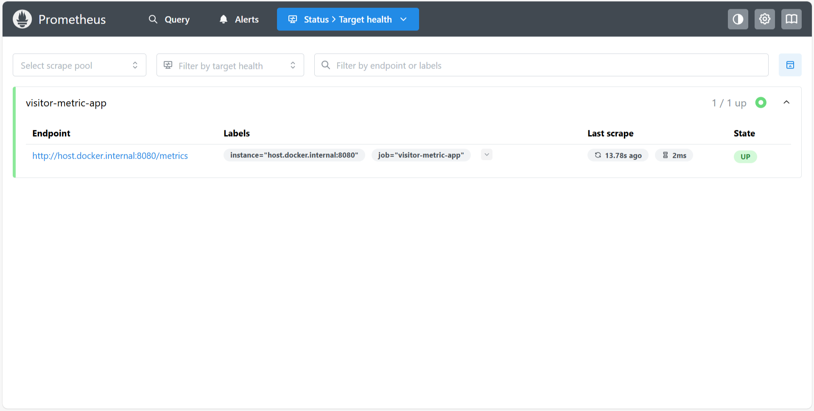
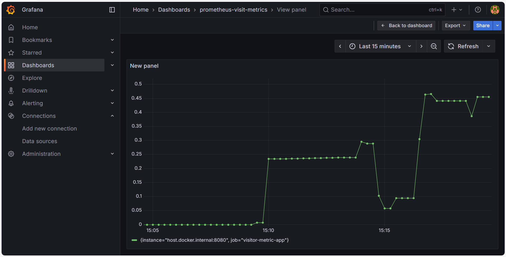

# Prometheus & Grafana Monitoring for a Go App

A simple project built to learn the fundamentals of Prometheus by monitoring a custom Go web application and visualizing the metrics in a real-time Grafana dashboard.

---

## Architecture

This diagram shows the complete monitoring flow from user interaction to real-time visualization. Each component serves a specific role in collecting, storing, and displaying metrics from the Go web application.



### How It Works

1. **User Traffic Generation**: Users visit the Go web server, generating HTTP requests that create metrics data
2. **Metrics Collection**: Prometheus scrapes the `/metrics` endpoint every 15 seconds, collecting time-series data  
3. **Data Querying**: Grafana uses PromQL queries to fetch metrics from the Prometheus database
4. **Real-time Visualization**: Users view live metrics and charts in Grafana dashboards

---

## Dashboard Preview

**Prometheus Targets Page:**
*This picture confirms that Prometheus is successfully connected to and scraping the Go application.*



**Grafana Dashboard:**
*This picture shows the final dashboard visualizing the rate of requests per second.*



---

## Built With

* Go
* Prometheus
* Grafana
* Docker & Docker Compose

---

## Getting Started

To get a local copy up and running, follow these steps.

### Prerequisites

You must have the following software installed:
* Go (version 1.21 or later)
* Docker and Docker Compose

### Installation & Running

1.  **Clone the repository:**
    ```bash
    git clone https://github.com/14yashh/prometheus-visit-metrics.git
    cd prometheus-visit-metrics
    ```

2.  **Start the Go Application:**
    Open a terminal, navigate into the web server's directory, and run the application.
    ```bash
    cd web-server
    go mod tidy  # Download dependencies if needed
    go run main.go
    ```
    The server should display: `Go server starting on port 8080...`

3.  **Start the Monitoring Stack:**
    Open a **second** terminal in the project's root directory and launch the Docker containers.
    ```bash
    docker-compose up
    ```

---

## Usage

Once the stack is running, you can access the different components:

* **Go Web App:** Visit `http://localhost:8080` to generate traffic.
* **App Metrics:** View the raw metrics at `http://localhost:8080/metrics`.
* **Prometheus UI:** Access Prometheus at `http://localhost:9090`.
* **Grafana Dashboard:** Access Grafana at `http://localhost:3000` (login: `admin`/`admin`).

---

## Troubleshooting

**Common Issues:**
* **Port conflicts**: Ensure ports 3000, 8080, and 9090 are available
* **Docker issues**: Make sure Docker daemon is running  
* **Metrics not showing**: Wait 15-30 seconds for initial Prometheus scraping
* **Go module issues**: Run `go mod tidy` in the web-server directory

---

## Project File Structure

The repository is organized as follows:

```
.
├── docker-compose.yml
├── prometheus.yml
├── README.md
├── images/
│   ├── grafana-dashboard.png
│   └── prometheus-targets.png
└── web-server/
    ├── go.mod
    ├── go.sum
    └── main.go
```